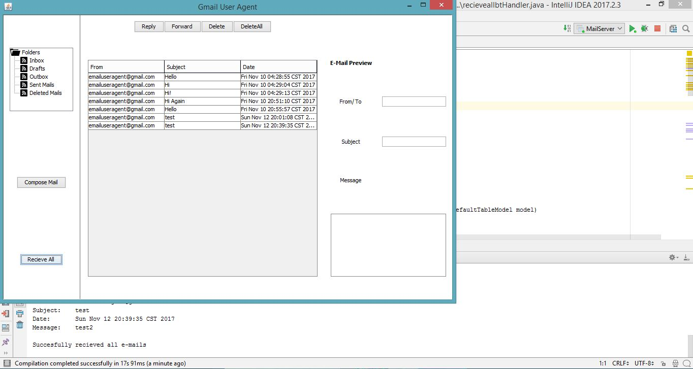

_Email User Agent for Gmail_
====================================

_**1. Introduction to Mail User Agent**_

Mail User Agent (MUA) or an Email Client is a computer program used to access and manage a user's email. Like most client programs, an email client is only active when a user runs it. The most common examples of Email Clients are Mozilla Thunderbird, Microsoft Outlook. 

_**2. Introduction to this java application**_

The mail user agent developed is meant to handle the user's email account right from the desktop environment. It can receive and store the emails, send it by means of facilities like forwarding, replying depending upon the user’s consent.

The mail user agent has following folders on the left panel - Inbox, Drafts, Outbox, Sent Mails and Deleted Mails. On the right panel, preview of the selected email can be found and read. 'Reply', 'Reply All', 'Delete' and 'Delete All' features are provided on top of center panel using JButton. For composing a new mail and receiving all the emails from web server, two additional buttons are provided on the left panel below the 'Folders' section.

_**3. Limitations of this application**_

    •	 Multiple selection and deletion of emails is currently not supported
    •	 A user can use his/her gmail account only. Other web mail services are not supported at present
    •	 Only Internet Message Access Protocol (IMAP) is supported. POP3, MIME and other protocols are not supported
    •	 Single account support only. Multiple accounts can not be setup at the momemt
    •	 Support for 'cc', 'bcc', attachments, setting up of signature, multimedia content and similar features which distiguishes a simple mailbox from others are lacking
    
_**4. Special Note**_

The application can be compiled and run using MySQL and any Java IDE including Eclipse and IntelliJ. All the java libraries are provided along with source files.

Please update the login credentials of the gmail account with which this application you want to use in 'LoginCredentials.properties' file.

At last please ensure that the gmail account which is intended to be used does not require special details to login from web gmail such as '2 step verification' and/or 'login with security question'. Kindly turn them off and then use this application. You may also be required to give permission in google accounts for using less secured application. According to google's policy user consent is required to use a less secured application. In this case since the application is not a commercial application hence google may treat this as a less secured application.

_**5. Application Screens**_

